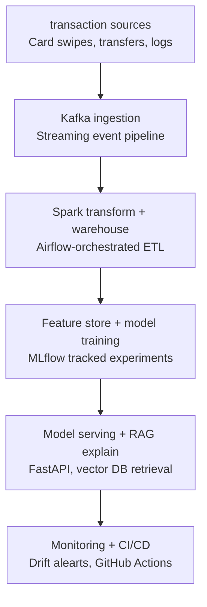

#Real - Time Transaction Intelligence Platform

An end-to-end AI Engineering System: streaming Transaction ingestion, ML-based fraud/anomaly detection, an LLM/RAG explanation layer, production model serving, monitoring, and CI/CD


## Architecture


See [docs/architecture.md](docs/architecture.md) for phases, dependencies, and risks.

## Tech stack

| Layer | Tools |
|---|---|
| Ingestion & streaming | Kafka |
| Transformation | Apache Spark (PySpark) - open-source AbInitio equivalent|
| Storage / warehouse | PostgreSQL |
| Orchestration | Airflow |
| Transformation modeling (optional) | dbt |
| Data quality | Great Expectations |
| Ml Training & tracking  | scikit-learn / gradient boosting, Mlflow |
| Feature store | Feast ( or documented SQL views) |
| Serving | FastAPI, Docker, Cloud Run / AWS Fragate |
| LLM / RAG | Anthropic or OpenAI API, pgvector / Chroma |
| Monitoring | Grafana / Streamlit |
| CI/CD & IaC | gitHub Actions, Terraform |

## Repository structure

​```
transaction-intelligence-platform/
├── docs/                 # architecture notes, diagrams, decision log
├── ingestion/            # Kafka producers/consumers, batch loaders
├── transform/            # PySpark transformation jobs
├── orchestration/
│   └── dags/             # Airflow DAGs
├── ml/
│   ├── features/         # feature engineering code
│   ├── training/         # model training scripts, MLflow runs
│   └── models/           # saved model artifacts (git-ignored)
├── serving/              # FastAPI app, Dockerfile
├── rag/                  # embedding, indexing, retrieval, prompt templates
├── monitoring/           # drift checks, dashboards
├── infra/                # Terraform
├── .github/workflows/    # CI/CD pipelines
└── README.md
​```

## Branching & versioning
- `main` is always deployable. Work on short-lived branches: `features/<phase>-<description>` (e.g. `feature/phase1-kafka-producer`).
- Merge viw pull request, even solo - gives you a place to write *why* ,not just *what*.
- commit messages follow Conventional Commits: `feat:`, `fix:`, `docs:`, `chore:`, `refactor:`.
-Tag a version at the end of each phase: `v0.1.0` after Phase 1, `v0.2.0` after Phase 2, etc.


## daily progress log
- Set up GitHub repo, folder structure, and this README
- Wrote the architecture diagram and phase/dependency/risk doc in `docs/architecture.md`
- Next: set up local kafka _ first producer script (Phase 1)